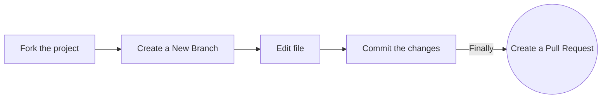

 
<h1 align="center"> # FATEC Zona Leste, SP - 1º Semestre - Projeto Integrado! </h1>

<a href="#sobre">Sobre</a> |
<a href="#projetoopensource">Projeto Open Source</a> |
<a href="#documentacao">Documentação</a> |
<a href="#designeprototipo">Design e Protótipo</a> |
<a href="#tecnologias">Tecnologias</a> |
<a href="#equipe">Equipe</a> |
<a href="#licenca">Licença</a>

## Sobre o projeto

O projeto **Seja Herói** tem como objetivo criar uma página web e futuramente mobile para ajudar diferentes ONG's em suas campanhas, ajudando tanto em diferentes arrecadações, quanto em visualização, divulgação e outros objetivos subsequentes. **Nesta primeira etapa** desenvolvemos as primeiras documentações e a primeira fase de design, responsividade e código do produto.

>*Projeto baseado em metodologia ágil, kanban, procurando desenvolver a colaboração, autonomia de serviço, proatividade e entrega de resultado dos envolvidos.*

> Projeto ainda em **desenvolvimento**.

> Projeto desenvolvido sob a orientação do professor [Francisco Douglas Lima  Abreu](https://www.linkedin.com/in/franciscodougllas/) e demais professores correspondentes as matérias satélites do curso de *Desenvolvimento de Software Multiplataforma*.

## Projeto Open Source

Caso queira contribuir para o projeto ou mesmo altera-lo para outros propósitos, você pode seguir os passos a seguir para clonar o repositório em seu **github!** Dependendo das modificações, após o período de avaliação do projeto  poderemos aceitar os Pull Request's.

### Documentação

A entrega das documentações foram feitas de forma contínua seguinto as aulas de **Engenharia de Software I** - conforme a evolução das atividades, evoluímos todos os documentos criados para o **Projeto Integrado**. 

| Documentação | Tag | Lançamento | Status | 
|:-----:|:-------------:|:----------:|:---------:|
| [Plano Estratégico do Projeto - Sumário Executivo](https://github.com/backtoaldo/sejaheroi/blob/main/Plano%20Estrat%C3%A9gico%20do%20Projeto/Plano%20Estrat%C3%A9gico%20do%20Projeto%20-%20Sum%C3%A1rio%20Executivo.pdf) | 01 | 12/09/2022 | Entregue | 
| [Plano Estratégico do Projeto - Metas do Projeto](https://github.com/backtoaldo/sejaheroi/blob/main/Plano%20Estrat%C3%A9gico%20do%20Projeto/Plano%20Estrat%C3%A9gico%20do%20Projeto%20-%20Metas%20do%20Projeto.pdf) | 02 | 12/09/2022 | Entregue |
| [Plano Estratégico do Projeto - Riscos](https://github.com/backtoaldo/sejaheroi/blob/main/Plano%20Estrat%C3%A9gico%20do%20Projeto/Plano%20Estrat%C3%A9gico%20do%20Projeto%20-%20Riscos.pdf) | 03 | 12/09/2022 | Entregue |
| [Plano Estratégico do Projeto - Questões em Aberto](https://github.com/backtoaldo/sejaheroi/blob/main/Plano%20Estrat%C3%A9gico%20do%20Projeto/Plano%20Estrat%C3%A9gico%20do%20Projeto%20-%20Quest%C3%B5es%20em%20Aberto.pdf) | 04 | 12/09/2022 | Entregue |
| [Plano Estratégico do Projeto - Análise SWOT](https://github.com/backtoaldo/sejaheroi/blob/main/Plano%20Estrat%C3%A9gico%20do%20Projeto/Plano%20Estrat%C3%A9gico%20do%20Projeto%20-%20An%C3%A1lise%20SWOT.pdf) | 05 | 19/09/2022 | Entregue |
| [Plano Estratégico do Projeto - Stakeholders](https://github.com/backtoaldo/sejaheroi/blob/main/Plano%20Estrat%C3%A9gico%20do%20Projeto/Plano%20Estrat%C3%A9gico%20do%20Projeto%20-%20Stakeholders.pdf) | 06 | 19/09/2022 | Entregue |
| [Plano Estratégico do Projeto - Plano de Comunicação](https://github.com/backtoaldo/sejaheroi/blob/main/Plano%20Estrat%C3%A9gico%20do%20Projeto/Plano%20Estrat%C3%A9gico%20do%20Projeto%20-%20Plano%20de%20Comunica%C3%A7%C3%A3o.docx.pdf) | 07 | 19/09/2022 | Entregue |

### Design e Protótipo

Pesquisa de Mercado, Wireframes, Mockup e Rascunhos feitos podem ser encontrados na aba projects.

>**Pesquisa de mercado:** Pesquisamos diferentes sites de Organizações Não Governamentais procurando cases de sucesso envolvendo usabilidade, visibilidade e responsividade.

>**Rascunhos:** Foram feitos diferentes esboços para o projeto, alguns em sala de aula, desenhos em outros softwares e outros já seguindo o formato do figma.

>**Wireframes:** Construímos os possíveis wireframes em cima das pesquisas de mercado e dos rascunhos desenvolvidos. Chegamos a muitas possibilidades e pegamos as menos complexas de implementar.

>**Mockup:** Feito no figma nas versões desktop web e mobile para diferentes celulares. ***Por enquanto se mantém na versão 1.0.***

| Nome | Tag | Data | Status |
|:-----:|:-------------:|:----------:|:---------:|

## Tecnologias

As seguintes ferramentas, linguagens, bibliotecas e tecnologias foram usadas na construção do projeto:

- [Figma](http://www.figma.com): Prototipagem
- [HTML](https://developer.mozilla.org/pt-BR/docs/Web/HTML): Estrutura das páginas do site
- [CSS](https://developer.mozilla.org/pt-BR/docs/Web/CSS): Estilização do site
- [Visual Studio Code](https://code.visualstudio.com/): Codificação
- [Discord](https://discord.com/): Comunicação
- [GitHub](https://github.com/): Versionamento e documentação

## Equipe

Membros do curso de Desenvolvimento de Software Multiplataforma presentes no projeto.

| Função | Nome | LinkedIn | GitHub |
| :----------: | :----------------------- | :-------------------------------------------------------------------: | :--------------------------------------------: |
| Team | Aldo Costa Silveira | [LinkedIn](https://www.linkedin.com/in/aldo-costa-silveira/) | [GitHub](https://github.com/backtoaldo) |
| Team | Andrey N. Caniello | [LinkedIn]() | [GitHub](https://github.com/ACaniello) |
| Team | Douglas Adão N. de Sousa | [LinkedIn](https://www.linkedin.com/in/douglasdans/) | [GitHub](https://github.com/DouglasDans) |
| Team | Jackeline | [LinkedIn]() | [GitHub](https://github.com/jackelinepaula) |
| Team | Pedro | [LinkedIn]() | [GitHub]() |
| Team | Priscila | [LinkedIn]() | [GitHub]() |

## Licença

Esse projeto está sob a licença MIT. Veja o arquivo [LICENSE](LICENSE) para mais detalhes.
