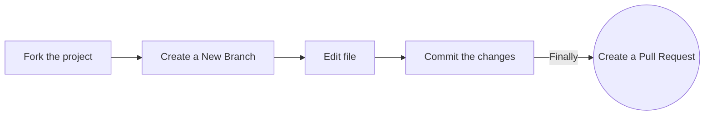

 
<h1 align="center"> # FATEC Zona Leste, SP - 1º Semestre - Projeto Integrado! </h1>

<a href="#sobre">Sobre</a> |
<a href="#projetoopensource">Projeto Open Source</a> |
<a href="#documentacao">Documentação</a> |
<a href="#designeprototipo">Design e Protótipo</a> |
<a href="#tecnologias">Tecnologias</a> |
<a href="#equipe">Equipe</a> |
<a href="#licenca">Licença</a>

## Sobre o projeto

O projeto **Seja Herói** tem como objetivo criar uma página web e futuramente mobile para ajudar diferentes ONG's em suas campanhas, ajudando tanto em diferentes arrecadações, quanto em visualização, divulgação e outros objetivos subsequentes. **Nesta primeira etapa** desenvolvemos as primeiras documentações e a primeira fase de design, responsividade e código do produto.

>*Projeto baseado em metodologia ágil, kanban, procurando desenvolver a colaboração, autonomia de serviço, proatividade e entrega de resultado dos envolvidos.*
>> Projeto ainda em **desenvolvimento**.

> Projeto desenvolvido sob a orientação do professor [Francisco Douglas Lima  Abreu](https://www.linkedin.com/in/franciscodougllas/) e demais professores correspondentes as matérias satélites do curso de *Desenvolvimento de Software Multiplataforma*.

## Projeto Open Source

Caso queira contribuir para o projeto ou mesmo altera-lo para outros propósitos, você pode seguir os passos a seguir para clonar o repositório em seu **github!** Dependendo das modificações, após o período de avaliação do projeto  poderemos aceitar os Pull Request's.

### Documentação

A entrega das documentações foram feitas de forma contínua seguinto as aulas de **Engenharia de Software I** - conforme a evolução das atividades, evoluímos todos os documentos criados para o **Projeto Integrado**. 

| Documentação - Levantamento de Requisitos | Tag | Lançamento | Status | 
|:-----:|:-------------:|:----------:|:---------:|
| [Diagrama de Casos de Uso](https://github.com/backtoaldo/sejaheroi/blob/main/Levantamento%20de%20Requisitos/Rascunho%20do%20Diagrama%20de%20Casos.pdf) | 01 | 26/09/2022 | Entregue | 

| Documentação - Plano Estratérico do Projeto | Tag | Lançamento | Status | 
|:-----:|:-------------:|:----------:|:---------:|
| [Plano Estratégico do Projeto - Sumário Executivo](https://github.com/backtoaldo/sejaheroi/blob/main/Plano%20Estrat%C3%A9gico%20do%20Projeto/Plano%20Estrat%C3%A9gico%20do%20Projeto%20-%20Sum%C3%A1rio%20Executivo.pdf) | 01 | 12/09/2022 | Entregue | 
| [Plano Estratégico do Projeto - Metas do Projeto](https://github.com/backtoaldo/sejaheroi/blob/main/Plano%20Estrat%C3%A9gico%20do%20Projeto/Plano%20Estrat%C3%A9gico%20do%20Projeto%20-%20Metas%20do%20Projeto.pdf) | 02 | 12/09/2022 | Entregue |
| [Plano Estratégico do Projeto - Riscos](https://github.com/backtoaldo/sejaheroi/blob/main/Plano%20Estrat%C3%A9gico%20do%20Projeto/Plano%20Estrat%C3%A9gico%20do%20Projeto%20-%20Riscos.pdf) | 03 | 12/09/2022 | Entregue |
| [Plano Estratégico do Projeto - Questões em Aberto](https://github.com/backtoaldo/sejaheroi/blob/main/Plano%20Estrat%C3%A9gico%20do%20Projeto/Plano%20Estrat%C3%A9gico%20do%20Projeto%20-%20Quest%C3%B5es%20em%20Aberto.pdf) | 04 | 12/09/2022 | Entregue |
| [Plano Estratégico do Projeto - Análise SWOT](https://github.com/backtoaldo/sejaheroi/blob/main/Plano%20Estrat%C3%A9gico%20do%20Projeto/Plano%20Estrat%C3%A9gico%20do%20Projeto%20-%20An%C3%A1lise%20SWOT.pdf) | 05 | 19/09/2022 | Entregue |
| [Plano Estratégico do Projeto - Stakeholders](https://github.com/backtoaldo/sejaheroi/blob/main/Plano%20Estrat%C3%A9gico%20do%20Projeto/Plano%20Estrat%C3%A9gico%20do%20Projeto%20-%20Stakeholders.pdf) | 06 | 19/09/2022 | Entregue |
| [Plano Estratégico do Projeto - Plano de Comunicação](https://github.com/backtoaldo/sejaheroi/blob/main/Plano%20Estrat%C3%A9gico%20do%20Projeto/Plano%20Estrat%C3%A9gico%20do%20Projeto%20-%20Plano%20de%20Comunica%C3%A7%C3%A3o.docx.pdf) | 07 | 19/09/2022 | Entregue |

| Documentação - Canvas | Tag | Lançamento | Status | 
|:-----:|:-------------:|:----------:|:---------:|
| [Canvas](https://github.com/backtoaldo/sejaheroi/blob/main/Canvas%20para%20o%20Projeto/Canvas/Canvas%20vers%C3%A3o%201.0.pdf) | 08 | 17/10/2022 | Entregue |

### Design e Protótipo

Pesquisa de Mercado, Wireframes, Mockup e Rascunhos feitos podem ser encontrados na aba projects.

>**Pesquisa de mercado:** Pesquisamos diferentes sites de Organizações Não Governamentais procurando cases de sucesso envolvendo usabilidade, visibilidade e responsividade.

>**Rascunhos:** Foram feitos diferentes esboços para o projeto, alguns em sala de aula, desenhos em outros softwares e outros já seguindo o formato do figma.

| Nome | Tag | Data | Status |
|:-----:|:-------------:|:----------:|:---------:|
| [Rascunho](https://github.com/backtoaldo/sejaheroi/blob/main/Design%20e%20Prot%C3%B3tipo/Rascunhos%20-%20001.pdf) | 01 | 12/09/2022 | Entregue |    
    
>**Wireframes:** Construímos os possíveis wireframes em cima das pesquisas de mercado e dos rascunhos desenvolvidos. Chegamos a muitas possibilidades e pegamos as menos complexas de implementar.

| Nome | Tag | Data | Status |
|:-----:|:-------------:|:----------:|:---------:|
| [Wireframe 1](https://github.com/backtoaldo/sejaheroi/blob/main/Design%20e%20Prot%C3%B3tipo/PI%20-%20Site%20Seja%20Her%C3%B3i!%20-%20Wireframes.pdf) | 01 | 07/10/2022 | Entregue |
| [Wireframe 2](https://github.com/SejaHeroi-Company/sejaheroi/blob/main/Design%20e%20Prot%C3%B3tipo/Wireframe%202%20-%20Be%20Hero.pdf) | 02 | 30/11/2022 | Entregue |

>**Mockup:** Feito no figma nas versões desktop web e mobile para diferentes celulares. ***Por enquanto se mantém na versão 1.0.***

Primeira Versão do protótipo no figma, com flow entre as páginas já adicionado:

 

| Nome | Tag | Data | Status |
|:-----:|:-------------:|:----------:|:---------:|
| [Versão 1.0](https://github.com/backtoaldo/sejaheroi/blob/main/Design%20e%20Prot%C3%B3tipo/Vers%C3%A3o%201.%200%20-%20Seja%20Her%C3%B3i!.pdf) | 01 | 07/10/2022 | Entregue |
| [Entrega das primeiras 4 telas ao professor](https://github.com/backtoaldo/sejaheroi/blob/main/Design%20e%20Prot%C3%B3tipo/PI%20-%20Site%20Seja%20Her%C3%B3i!%20-%20Primeira%20entrega%20(Home%2C%20Lista%20User%2C%20Cadastro%2C%20Cadastro%20Caso).pdf) | 02 | 07/10/2022 | Entregue |

## Tecnologias

As seguintes ferramentas, linguagens, bibliotecas e tecnologias foram usadas na construção do projeto:

- [Figma](http://www.figma.com): Prototipagem
- [HTML](https://developer.mozilla.org/pt-BR/docs/Web/HTML): Estrutura das páginas do site
- [CSS](https://developer.mozilla.org/pt-BR/docs/Web/CSS): Estilização do site
- [JavaScript](https://www.javascript.com/)
- [Visual Studio Code](https://code.visualstudio.com/): Codificação
- [Discord](https://discord.com/) e [Microsoft Teams](https://www.microsoft.com/en/microsoft-teams/log-in): Comunicação
- [GitHub](https://github.com/): Versionamento e documentação

### Primeiro Pitch

- [Vídeo de apresentação do projeto - Você será levado ao youtube ao clickar no link.](https://youtu.be/g2OVaMyGLzI)

## Equipe

Membros do curso de Desenvolvimento de Software Multiplataforma presentes no projeto.

| Função | Nome | LinkedIn | GitHub |
| :----------: | :----------------------- | :-------------------------------------------------------------------: | :--------------------------------------------: |
| Team | Aldo Costa Silveira | [LinkedIn](https://www.linkedin.com/in/aldo-costa-silveira/) | [GitHub](https://github.com/backtoaldo) |
| Team | Andrey N. Caniello | [LinkedIn](https://www.linkedin.com/in/andrey-caniello-6313b1208/) | [GitHub](https://github.com/ACaniello) |
| Team | Douglas Adão N. de Sousa | [LinkedIn](https://www.linkedin.com/in/douglasdans/) | [GitHub](https://github.com/DouglasDans) |
| Team | Jackeline Paula Teles Menezes | [LinkedIn](https://www.linkedin.com/in/jackeline-menezes) | [GitHub](https://github.com/jackelinepaula) |
| Team | Pedro | [LinkedIn]() | [GitHub]() |
| Team | Priscila | [LinkedIn]() | [GitHub](https://github.com/alvesprih) |

## Licença
[GNU GENERAL PUBLIC LICENSE](https://github.com/backtoaldo/sejaheroi/blob/main/LICENSE.md)

The GNU General Public License is a free, copyleft license for software and other kinds of works.

>The licenses for most software and other practical works are designed to take away your freedom to share and change the works. By contrast, the GNU General Public License is intended to guarantee your freedom to share and change all versions of a program--to make sure it remains free software for all its users. We, the Free Software Foundation, use the GNU General Public License for most of our software; it applies also to any other work released this way by its authors. You can apply it to your programs, too.

>When we speak of free software, we are referring to freedom, not price. Our General Public Licenses are designed to make sure that you have the freedom to distribute copies of free software (and charge for them if you wish), that you receive source code or can get it if you want it, that you can change the software or use pieces of it in new free programs, and that you know you can do these things.
